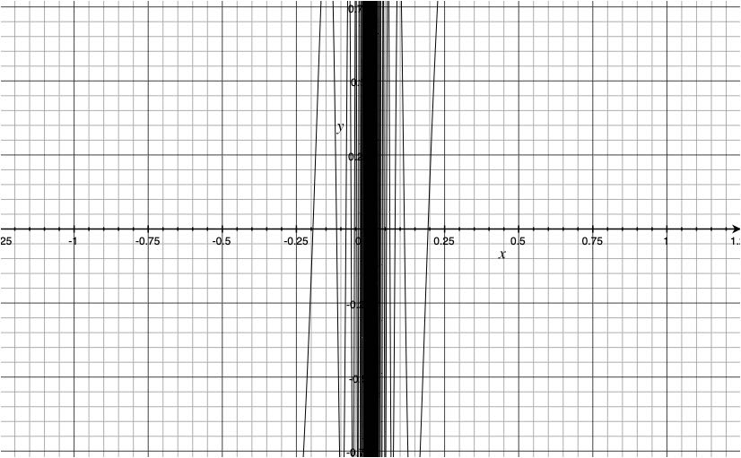

# Homework 8

Mark Archual | MTH 515

Dr. Scott | Real Analysis

4/10/19

## Problem 5.2.7

### Original Solution

#### _Part A_

Let $a = 3/2$, then $g'_a$ is unbounded on [0,1]. See the plot below.

#### _Part B_

Let $a = 3$, then $g'_a$ is 

$$x (3 x \sin(1/x) - \cos(1/x))$$

which from the plot we can see is continuous, but the limit as x approaches 0 does not exist due to the dense oscillation seen near the origin.  This is confirmed by observing $g''_a$:

$$ \frac{((6 x^2 - 1) \sin(1/x))}{x} - 4 \cos(1/x)$$

the x term in the denominator renders the whole expression as not defined at 0, thus $g'_a$ is not differentiable at 0.

#### _Part C_

Let $a =4$.  Following a similar approach shown in _Part B_ we see that $g'_a$ appears to be reasonably well behaved on $\mathbb{R}$

$$g'_a = x^2 (4 x \sin(1/x) - \cos(1/x))$$

Taking $g''_a$ yields oscillations near the origin that hint that differentiability may not be well defined on all of $\mathbb{R}$

$$g''_a = (12 x^2 - 1) \sin(1/x) - 6 x \cos(1/x)$$

Taking $g'''_a$ we see a value of $x^2$ in the denominator indicating that the limit d.n.e. at 0.

$$g'''_a = \frac{ (6 x (4 x^2 - 1) sin(1/x) + (1 - 18 x^2) cos(1/x))}{x^2}$$

### Self-Evaluation

## Problem 5.3.2

### Original Solution

_Let $f$ be differentiable on $A$.  If $f'(x) \neq 0$ on $A$ then $f$ is one-one_

Using a corollary of the Mean Value Theorem, because $f'(x) \neq 0$ on $A$ then we know $f(x)$ is not constant.  By the Interior Extremum Theorem because $f'(c) \neq 0 \forall x \in A$ then we know that f does not attain a minimum or maximum on A.  Therefore f must be a monotonic function on $A$.  Monotonic functions fulfill the requirements of being one-one.

$\therefore f$ is one-one.

As an example of the converse not being true, consider $f = x^3$ we know $x^3$ is one to one, as it is monotonic, however $f' = x^2 = 0$ for $x = 0$.

### Self-Evaluation

## Problem 6.2.3

### Original Solution

For $g_n \ldots$

#### _Part A_

For a fixed $x$ as $n -> \infty$

$$ \lim g_n(x) = \left\{\begin{aligned}
&0 &&: x > 1\\
&x &&: x < 1 \\
&1/2 &&: x = 1
\end{aligned}
\right. $$

#### _Part B_

$g_n$ is not uniformly convergent because for the convergence of the function depends on the value of x chosen.

#### _Part C_

$(1, \infty) \forall x \in A, \lim g_n -> 0$ regardless of x.

For $h_n \ldots$

#### _Part A_

For a fixed $x$ as $n -> \infty$

$$ \lim h_n(x) = \left\{\begin{aligned}
&1 &&: x > 1/n\\
&nx &&: 0 \leq x < 1 
\end{aligned}
\right. $$

#### _Part B_

$h_n$ is not uniformly convergent because for the convergence of the function depends on the value of x chosen.

#### _Part C_

$[1, \infty) \forall x \in A, \lim h_n -> 1$ regardless of x.

### Self-Evaluation

## Problem 6.3.3

### Original Solution

#### _Part A_

$f_n(x) = \frac{x}{1+nx^2}$.  When n = 1, $f_1(x) = \frac{x}{1+x^2}$, which has roots of -1, 1 and a max/min of -0.5, 0.5 respectively.  As $n->\infty, f_n(x) -> 0$, regardless of x.  Therefore we know, we are safe to assume that the behavior of the function as n changes is not dependent on x.

With this knowledge we can then move to find the max and min values for x in terms of n. The roots of the derivative show that x is a max/min when:

$$ x = \pm \sqrt{\frac{1}{n}}$$

Therefore we can apply the cauchy criterion to show that

$$\lvert f_m - f_n \rvert = \textrm{max}(\pm \sqrt{\frac{1}{n}}, \pm \sqrt{\frac{1}{m}}) < \epsilon$$

$$\therefore \lim_{n-> \infty} \frac{x}{1+nx^2} = 0$$

#### _Part B_

$$f'_n(x) = \frac{1-nx^2}{(1+nx^2)^2}$$

$f' = \lim f'_n$ when $x \neq 0$

### Self-Evaluation

## Problem 6.4.3

### Original Solution

#### _Part A_

We know that $\cos(2^n*x) \leq 1 \forall x,n$.  This reduces the summation to 

$$\sum^{\infty}_{n=0} \frac{1}{2^n}$$

$\frac{1}{2^n}$ is a geometric series with a ratio of $\frac{1}{2}$ therefore the infinite sum converges.  This allows us to use the weierstrauss M-test to show that 

$$\lvert f_n(x) \rvert \leq \sum^{\infty}_{n=0} \frac{1}{2^n}$$

thus f converges uniformly and f is continuous.

#### _Part B_

Theorem 6.4.3 states that $\sum g'_n(x)$ must converge uniformly.  In this case, $g'(x) = 2^n\sin(2^nx)$, which $\sum \sum^{\infty}_{n=0} \frac{1}{2^n}$ does not converge uniformly, as it is unbounded.  Thus g is not differentiable.

### Self-Evaluation

## Problem 6.5.4

### Original Solution

I struggled with this question.  I had a hard time seeing how to get started.  I think I would have been able to succeed if the book or our lecture notes provided more examples.

### Self-Evaluation

## Problem 6.6.2

### Original Solution

#### _Part A_

$x\cos(x^2) = x^3 - \frac{x^5}{2!} + \frac{x^9}{4!} - \frac{x^{13}}{6!} \ldots$

#### _Part B_

This one I struggled with, mainly for algebraic reasons.  I had trouble seeing how to do the substitutions.

#### _Part C_

$\ln(1+x^2) = x^2 - \frac{x^4}{2} + \frac{x^6}{3} - \frac{x^8}{4} \ldots$

### Self-Evaluation

## External References
