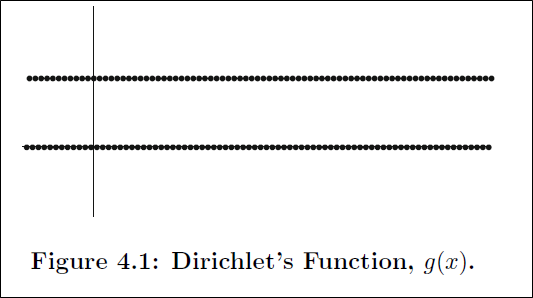
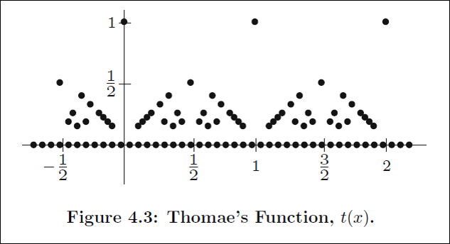

# Chapter 7 Project

## Project Members and Roles

| Members      	| Exercises      	|
|--------------	|----------------	|
| Vishnu Aerva 	| 2, 5, 7, 16    	|
| Mark Archual 	| 11, 12, 15    	|
| Esra Celik   	| 14, 17, 18, 19 	|

---

## Topic Summary

Our group was tasked with studying Lebesgue's Criterion for Riemann Integration.

### Motivation

Riemann integration provides us with a foundation to define integration, even if a function is not perfectly continuous.  However, Riemann integration does not cover all discontinuous functions, which may lead to the question, how discontinuous can a function be, and still maintain some form of integrability?  What other definitions of integration exist, and how do expand upon, Riemann integration?

As shown in the book, Thomae's function and Dirichlet's function can provide some useful contrast for the scenario described above.  

 

Observe that thomae's function, while certainly discontinuous one can construct the necessary conditions to show that it is indeed Riemann integrable (see Exercise 7.6.2).  Dirichlet's function does not fit the criteria, due to it being discontinuous at every point in its domain (as discussed in class).  Dirichlet's function is just an example, of many functions that fail to be Riemann integrable, so the need for a stronger form of integration is certainly justified.

### Theory

Lebesgue's Criterion for Riemann Integrability relies on two key definitions.

#### Sets of Measure Zero

A set $A \subseteq \mathbb{R}$ has _measure zero_ if, for all $\epsilon > 0$, there exists a contable collection of open intervals, $O_n$ wiht the property that A is contained in the union of all of the intervals $O_n$ and the sum of the lengths of all of the intervals is less than or equal to $\epsilon$.  More precisely, if $\lvert O_n \rvert$ refers to the length of the interval $O_n$, then we have $\ldots$

See Exercise 7.6.5 for more details.

$$ A \subseteq \cup_{n=1}^{\infty} O_n$$

and

$$\sum_{n=1}^{\infty} \lvert O_n \rvert \leq \epsilon$$

#### $\alpha$-Continuity

Let $f$ be defined on $[a,b]$ and let $\alpha > 0$. The function $f$ is $\alpha$-continuous at $x \in [a,b]$ if there exists $\delta > 0$ such that for all $y,z \in (x - \delta, x + \delta)$ it follows that $\lvert f(y) - f(z) \rvert < \alpha$

See Exercise 7.6.7 for more information.

#### Lebesgue's Criterion for Riemann Integrability

Let $f$ be a bounded function defined on the interval $[a,b]$. Then, f is Riemann-integrable if and only if the set of points where $f$ is not continuous has measure zero.

A partial proof is presented in Exercises 7.6.11 and 7.6.12.

### Consequences

Practically, Lebesgue's criterion helps further define what functions are Riemann integrable by giving a more specific criteria for continuity ($\alpha$-continuity) and setting a bound on what is acceptable for discontinuity.

Can we apply Lebesgue's Criterion to Dirichlet's function?  Yes, however we still see that the function is not integrable because the discontinuities do not form a set of measure zero.  The book also provides an example of a function that is differentiable, but fails to be integrable, breaking with the fundamental theorem of calculus.  Clearly, there is further room for improvement on our definition of integration and the book briefly discusses Lebesgue integration as that next step. Further investigation into this topic is outside of the scope of this project.

> Write-up prepared by Mark Archual

---

## Exercise 7.6.2

### _Part A_

As $C$ is the Cantor set, $C$ is dense nowhere which implies that for any $\delta > 0$, there exists $x \in V_\delta(x)$ such that $x \notin C$.

Let us consider some $a \in C$ and $a_n \in V_{frac{1}{n}}(x)$ such that $a_n \notin C$

$$\lim_{n \to \infty} h(a_n) = 0 \neq h(x)$$

which shows that h(x) is not continuous on C.

TO show that $h(x)$ is continuous on $[0,1] \setminus C$ consider that $[0,1] \setminus C$ is everywhere dense, which implies that there exists a $\delta > 0$ such that $V_\delta(x) \cap C = \emptyset$ for all $x\in[0,1] \setminus C$.

Also, $C$ is a closed set so such a neighborhood must exist in $[0,1] \setminus C$ and $h(a) = 0$ for $a \in V_\delta(x)$ thus it is continuous.

### _Part B_

> Proof

$C$ is the Cantor set and we know that for $c \in C_n$ where $C_n$ is given by

$$ C_n = \cup_{k=0}^{2n-1} ([\frac{3k+0}{3^n}, \frac{3k+1}{3^n}] \cup [\frac{3k+1}{3^n}, \frac{3k+3}{3^n}])$$

Consider a partition $P_n$ of $[0,1]$ given by $0 < \frac{1}{3^n} < \frac{2}{3^n} < \ldots < \frac{3^n -1}{3^n} < 1$.

As shown in _Part A_, the Cantor set, $C$, is nowhere dense.  Because of this we can say that there is an irrational point in every subinterval of every partition where $h(x) = 0$.

$$ \therefore L(h, P_n) = 0$$

Again, for the partition $0 < \frac{1}{3^n} < \frac{2}{3^n} < \ldots < \frac{3^n -1}{3^n} < 1$

We can define the supremum for $x \in C_n \textrm{sup}(h(x): x \in [x_{k-1}, x_{k}]) = 1$, otherwise for $x \notin C_n, x = 0$.

This gives

$$U(h, P_n) = \sum_{k=1}^{2n-1}\frac{2}{3^n} = (\frac{2}{3})^n \to 0$$

$$\lim_{n \to \infty}U(h, P_n) - L(h, P_n) \to 0$$
as
$$n \to \infty$$

$\therefore h$ is integrable$

> Solution provided by Vishnu Aerva

## Exercise 7.6.5

Let $A$ and $B$ be sets of measure zero.  This means that $A$ can be expressed as

$$ A \subseteq \cup_{n=1}^{\infty} O_n$$

and

$$\sum_{n=1}^{\infty} \lvert O_n \rvert \leq \frac{\epsilon}{2}$$

Similarly B can be expressed as

$$ B \subseteq \cup_{n=1}^{\infty} P_n$$

and

$$\sum_{n=1}^{\infty} \lvert P_n \rvert \leq \frac{\epsilon}{2}$$

where $O_n$ and $P_n$ are both open intervals and $\epsilon > 0$.

Because it is known that the union of any countable set is countable, this implies that the collection

$$(O_n, P_n: n \in \mathbb{N})$$ is a countable collection of open intervals that covers $A \cup B$

Also 

$$\sum_{n=1}^{\infty} (\lvert O_n \rvert + \lvert P_n \rvert) = \sum_{n=1}^{\infty} \lvert O_n \rvert + \sum_{n=1}^{\infty} \lvert P_n \rvert < \frac{\epsilon}{2} + \frac{\epsilon}{2} < \epsilon$$

$\therefore A \cup B$ has measure zero.

Now take $A = (A_1, A_2, \ldots A_n)$ to be some countable collection of sets of measure zero.

> Proof by induction

> For i = 1
A is already said to have measure zero so the **induction is grounded.**

> For i = 2 

$A_1 \cup A_2$ has measure zero, as $A_1$ and $A_2$ have measure zero as is proved above.

> For i = k

Let us assums that for a collection of $k$ sets, the above statement is true.  This can also be written as:

$(O_n: 1 \leq i \leq k, n \in \mathbb{N})$

which is a countable collection of open intervals that covers $\cup_{i = 1}^{k} A_i$

And 

$\sum_{i=1}^k \sum_{n=1}^{\infty} \lvert O_{i,n} \rvert < \frac{\epsilon}{2}$

> For i = k + 1

We have:

$(O_{n,i}, O_{k+1} : 1 \leq i \leq k,n \in \mathbb{N})$ 

is a countable collection of open intervals that covers

$\sup_{i = 1}^k A_1 \cup A_{k+1}$ i.e. $\cup_{i=1}^{k+1}A_i$

And $$\sum_{i=1}^k \sum_{n=1}^{\infty} \lvert O_{i,n} \rvert + \sum_{n=1}^{\infty} \lvert O_{k+1} \rvert < \frac {\epsilon}{2} + \frac{\epsilon}{2} < \epsilon$$

Hence we can say that the statement is true for $i = k + 1$

$\therefore$ the union of sets of measure zero also has measure zero.

> Solution provided by Vishnu Aerva

## Exercise 7.6.7

### _Part A_

Consider the given statement: $f$ is continuous at $x \in [a,b]$.

Consider some $\epsilon$ such that $\epsilon \in (0, \frac{\alpha}{2})$.  Written another way, $0 < \epsilon < \frac{\alpha}{2}$.

There are some $y$ and $z$ such that $y,z \in (x - \delta, x + \delta)$ where $\delta > 0$.  This implies that whenever

$$\lvert x - y \rvert < \delta$$

then

$$\lvert f(x) - f(y) \rvert < \epsilon$$

Now we can write that:

$$ \lvert f(y) - f(z) \rvert \leq \lvert f(y) - f(x) \rvert +  \lvert f(x) - f(z) \rvert \leq \epsilon + \epsilon \leq 2\epsilon$$

$$\lvert f(y) - f(z) \rvert < \alpha$$

$\therefore f$ is $\alpha$-continuous at $x$.

### _Part B_

> Proof by Contradiction

Assume that $f$ is not continuous but $f$ is still $\alpha$-continuous for every $\alpha > 0$, there exists $\delta > 0$ such that $\forall y, z \in (x - \delta, x + \delta) \lvert f(y) - f(z) \rvert < \alpha$

If z = x,

$$ \lvert f(y) - f(x) \rvert < \alpha$$

$\alpha > 0$, whenever $\lvert y - z \rvert < 2\delta$ which implies that $f$ is continuous, which is a contradiction of our assumption.

$\therefore f$ must not be $\alpha$-continuous if $f$ is not continuous.

Assume $x \in D^{\alpha n}$, thus $D \subseteq \cup_{n=1}^{\infty} D^{\alpha n}$.

On the other hand, suppose $x \in D^{\alpha n}$ for all $n$ choose $y_n, z_n \in (x - \alpha_n, x + \alpha_n)$ such that $\lvert f(y_n) - f(z_n)\rvert \geq \alpha_n$

Note:

$$ \lim y_n - \lim z_n = x$$

But if $f$ is continuous at $x$, then 

$$\lim f(y_n) = \lim f(z_n) = x$$, then there would be a N, such that

$$\lvert f(y_n) - f(z_n) \rvert < a_n$$ for all $n >N$, which is a contradiction.  Thus each $D_{\alpha n} \subseteq D$ and $D = \cup_{n=1}^{\infty} D^{\alpha n}$.

> Solution provided by Vishnu Aerva

## Exercise 7.6.11

Let $P_G$ be the partition containing the intervals in the set $G = {G_1, G_2, ... ,G_N}$ as defined in exercise 7.6.9.

Let $P_I$ be the partition formed from the set $K$, where $K = [a,b] \setminus \cup_{n=1}^{N} = {I_{N+1}, I_{N+2}, ... I_{n}}$ as defined in the text.

We know that $f$ is $\alpha$-continuous on this set because they do not contain the points from $G$, which are the points where $\alpha$-continuity fails.  We also know from previous exercises that, 

$$ \sum_{n=1}^{N} \lvert G_n \rvert < \frac{\epsilon}{4M} $$

where $M$ is supremum of $f(x)$.

Then for $P_G$ $\ldots$

$$U(f, P_G) - L(f, P_G) = \sum_{n=1}^{N} \lvert G_n \rvert * \lvert M_n - m_n \rvert \leq M \sum_{n=1}^{N} \lvert G_n \rvert < \frac{\epsilon}{2}$$

And for $P_I$ $\ldots$

$$U(f, P_I) - L(f, P_I) = \sum_{n = N+1}^{N + k} \lvert M_n - m_n \rvert \lvert I_n \rvert < \frac{\epsilon}{2}$$ for some $k \in \mathbb {N}$.

Then let $P_{\epsilon} = P_G + P_I$ and

$$U(f, P_{\epsilon}) = L(f, P_{\epsilon}) = \sum_{n=1}^{N} \lvert G_n \rvert * \lvert M_n - m_n \rvert + \sum_{n = N+1}^{N + k} \lvert M_n - m_n \rvert \lvert I_n \rvert < \frac{\epsilon}{2} + \frac{\epsilon}{2} = \epsilon$$

> Solution provided by Mark Archual

## Exercise 7.6.12

### _Part A_

Because $f$ is Riemann integrable, there exists a partition, $P_{\epsilon}$ of $[a,b]$ such that $f$ is Riemann integrable over the partition.

From theorem 7.6.4, we see that because $[a,b]$ is closed and bounded, and because $P_{\epsilon}$ is a union of open sub-intervals that covers $[a,b]$ there exists a finite sub-collection of intervals, $I_{N+1}, I_{N+2}, ... , I_{N+k}, k \in \mathbb{N}$, that also cover $[a,b]$.  Let this set be the interval over which $f$ is Riemann integrable.  Then, there also exists a set where $f$ fails to be $\alpha$-continuous, $I_1, I_2, ... I_N$.

Putting these ideas together, we see that $\ldots$

$U(f,$ $P_{\epsilon}$)$ - L(f,$ $P_{\epsilon}$)$ < \alpha \epsilon$

$\sum_{n = 1}^{N+k} \lvert M_n - m_n \rvert \lvert I_n \rvert < \epsilon$

$\sum_{n = 1}^{N} \lvert M_n - m_n \rvert \lvert I_n \rvert \leq \epsilon$

$\alpha \sum_{n = 1}^{N} \lvert I_n \rvert \leq \epsilon$

$\sum_{n = 1}^{N} \lvert I_n \rvert \leq \frac{\epsilon}{\alpha}$

where $\alpha > 0$.

$\therefore D^{\alpha}$ has zero measure.

### _Part B_

We know from previous exercises, that $D = \cup_{n=1}^{\infty} D^{\alpha_n}$ where $\alpha_n = \frac {1}{n}$ and $D^\alpha \subseteq D$.  Because each $D^{\alpha_n}$ has measure zero (as shown above), and from exercise 7.6.5 we have that the union of countable sets of measure zero also have measure zero, 

$$ D = \cup_{n=1}^{\infty} D^{\alpha_n} = 0 $$

> Solution provided by Mark Archual

## Exercise 7.6.14

### _Part A_

Given 

$$g(x) = \left\{
        \begin{array}{ll}
            x^2 \sin(\frac{1}{x}) & \quad x > 0 \\
            0 & \quad x \leq 0
        \end{array}
    \right.
$$

$$g'(0) = \lim_{x \to 0}{\frac{g(x) - 0}{x}} = \lim_{x \to 0}{x\sin(\frac{1}{x})} = 0$$    

### _Part B_

Using standard rules for differentation $g'(x)$ for $x \neq 0$ can be computed as follows:

$$g'(x) = 2x\sin(\frac{1}{x}) - \cos(\frac{1}{x})$$

### _Part C_

By the Archimedean Property there exists $2n$ such that $\frac{1}{2n\pi} < g$.  Consider the interval $[\frac{1}{(2n+1)\pi}, \frac{1}{2n\pi}]$

$$g'(\frac{1}{(2n+1)\pi}) = -\cos((2n+1)\pi) = 1$$

Similarly $\ldots$

$$g'(\frac{1}{2n\pi}) = -\cos((2n\pi) = -1$$

Since $g'(x)$ is continuous on $[\frac{1}{(2n+1)\pi}, \frac{1}{2n\pi}]$ by the intermediate value theorem, $g'(x)$ attains every value between -1 and 1.  Then $\forall \delta > 0, \exists x \in (-\delta, \delta)$ such that $g'(x) \neq 0 = g'(0)$ which shows that $g'(x)$ is not continuous at $x=0$.

> Solution provided by Esra Celik

## Exercise 7.6.15

### _Part A_

For $c \in C$,

$$ \lim_{n \to \infty} f_n(c) = 0$$

as $f$ is defined to be zero for values within the cantor set.

### _Part B_

For $x \notin C$, 

then for all values of $n$, $f_n$ takes on the shifted values of $g(x)$,, which does not equal 0.

Thus 

$$ \lim_{n \to \infty} f_n(x) \neq 0 $$

> Solution provided by Mark Archual

## Exercise 7.6.16

### _Part A_

We know the Cantor set $C$ is defined as $C = \cap_{n = 0}^{\infty} C_n$

where 

$$C_0 = [0,1]$$
$$C_1 = [0, \frac{1}{3}] \cup [\frac{2}{3}, 1]$$

etc.

Define $f_0(x) = 0 \forall x \in [0,1] = C_0$

Similary, define $f_1$ on $C_1$, where $f(x) = 0$ if $x \in C_1$ otherwise for $x \notin C_1$

$$f_1(x) = \left\{
        \begin{array}{ll}
            g(x - \frac{1}{3}) & \quad x \textrm{ just to the right to 1/3} \\
            g(-x + \frac{2}{3}) & \quad x \textrm{ just to the left of 2/3}
        \end{array}
    \right.
$$

where $g$ is defined as

$$g(x) = \left\{
        \begin{array}{ll}
            x^2 \sin(\frac{1}{x}) & \quad x > 0 \\
            0 & \quad x \leq 0
        \end{array}
    \right.
$$

If $x \notin C$ then according to the definition of Cantor sets, it is clear that $x \notin C_N$ for all $N \in \mathbb{N}$

So $x$ is in the complement of $C_N$, $x \in C_N^c$

However, $C_N^c$ contains only open intervals which implies that there exists an open interval, $O$, such that 

$$ x \in O \subseteq C_N^c$$

where $\forall y \in O$

$$f(y) = f_N(y)$$

$f_N$ is differentiable everywhere and $O$ is an open interval containing $x$.  This means that $f$ is differentiable at $x$.

### _Part B_

Take a fixed $c \in C$ and any arbitrary number $x \in [0,1]$.

> Case 1

If $x \in C$, then $f(x) = 0$

so

$$\lvert f(x) \rvert \leq \lvert x - c \rvert ^2$$ is trivial.

> Case 2

If $x \notin C$, then from our definition of $g(x)$ it implies that $f(x) = (x - c')^2 \sin(\frac{1}{x-c'})$ for some $c' \in C$.

But as $\sin(\frac{1}{x-c'})$ is a bounded function between $[-1, 1]$ so:

$$-(x-c')^2 \leq f(x) \leq (x-c')^2$$ implies:

$$\lvert f(x) \leq (x-c')^2$$

where $c'$ is an endpoint of the interval that makes on ore more than one $C_n$.  These end points can be taken in such a way that no element $C$ lies between $x$ and $c'$.

This means that:

$$\lvert x - c' \rvert \leq \lvert x - c \rvert$$

which implies

$$\lvert f(x) \rvert \leq (x - c')^2 \leq (x - c)^2$$

Now to show that $f'(c) = 0$

$$ \lvert \frac {f(x) - f(c)}{x-c} \rvert = \lvert \frac{f(x)}{x-c} \rvert$$
$$\leq \lvert x - c \rvert^2 / \lvert x - c \rvert = \lvert x - c \rvert$$

Because $c \in C$ implies $f(c) = 0$ this implies that

$f'(c) = \lim_{x \to c} \frac{f(x) - f(x)}{x-c}$

$f'(c) = 0$

### _Part C_

Construct a set $C_E$ which contains a countable set of points that appears at the end of the intervals which make $C_1, C_2, ... C_n$

This implies that $f'(x)$ fails to be continuous at each point belonging to $C_E$. But it attains every value between $1$ and $-1$ in the neighborhood of $C_E$.

Now for any arbitrary point $c \in C$ there exists a sequence $<C_n> \in C_E$ such that $<C_n> \to c$.

Take any arbitrary $\delta > 0$ and choose $N \in \mathbb{N}$ such that $\lvert C_N - c \rvert < \frac{\delta}{2}$.

This implies $(C_N - \frac{\delta}{2}, C_N + \frac{\delta}{2}) \subseteq (c - \delta, c+ \delta)$. But $C_N \in C_E$ and $f'$ attains every value between $1$ and $-1$ in the neighborhood of $(C_N - \frac{\delta}{2}, C_N + \frac{\delta}{2})$.

This implies that $f'$ attains every value between $1$ and $-1$ in the neighborhood of $(C - \delta, C + \delta)$.

$\delta$ being arbitrary means that $f'$ is not continuous at any point $c$.

> Solution provided by Vishnu Aerva

## Exercise 7.6.17

$f'(x)$ is Riemann-integrable on [0,1] because _$f'$ is discontinuous only on C which is known to have measure zero_.  By Lebesgue's Theorem for Riemann-integrability, $f'$ must be integrable on [0,1].

> Solution provided by Esra Celik

## Exercise 7.6.18

On the first step, $\frac{1}{9}$ of the middle part is removed and on the second step, the middle $\frac{1}{27}$ is removed from the remaining two parts after the first step. Continuing on, the sum of the remaining portion is given by

$$ \frac{1}{9} + \frac {1}{27} + \frac{2^2}{3^4} + \ldots = \sum_{n=1}^{\infty} \frac {2^{n-1}}{3^{n-1}} = \frac{1}{9} \sum_{n=1}^{\infty} \frac{2}{3}^n = \frac {1}{3} $$

This shows that the sum of lengths of intervals that make up $C_n$ is $1 - \frac{1}{3} = \frac{2}{3}$ which is not zero.

__Result:__ Sum of intervals that make up $C_n$ tends to $\frac{2}{3}$ as $n \to \infty$.

> Solution provided by Esra Celik

## Exercise 7.6.19

Let $c_1' = [0, \frac{4}{9}] \cup [\frac{5}{9}, 1]$ and $c_{n+1}' = \frac{1}{3^{n+1}}c_n' \cup (\frac{5}{9} + \frac{1}{3^{n+1}}c_n')$

$c' = \cap_{n=1}^{\infty} c_n'$ is called the fat Cantor set which is discussed above the problem.  Define $g_n: [0,1] \to [0,1]$ as a continuously increasing function that maps each interval of $c_n$ to $c_n'$ (where $c_n$ is used to construct c).  Each $g_n$ is a bijection that maps the partition of $[0,1]$ by $c_n$ to partition of $[0,1]$ by $c_n'$.  Each boundary point of $c_n$ is mapped to a boundary point of $c_n'$ and for all $m \geq n, g_m(x) = g_n(x)$ if $x \notin c_n$ so $\lim_{n \to \infty} g_n(x)$ exists if $x \notin c$.  If $c \in C$, then there exists some interval in $C_n$ whose length is $\frac{1}{3}n$ which gets mapped to the interval in $c_n'$ whose length is not greater than $\frac{1}{3^{n-1}}$, i.e. there exists $c' \in C'$ such that $\lvert g_n(c) - c' \rvert < \frac {1}{3^{n-1}}$ so $\lim_{n \to \infty} g_n(c)$ exists.

Define

$$ g(x) = \lim_{n \to \infty} g_n(x)$$

where $g: [0,1] \to [0,1]$ such that $g: c \to c'$ and g is continuous and increasing and is a bijection as well.  Let f be defined as 

$$f(x) = \lim_{n \to infty}f_n(x)$$

as in 7.6.15 which is integrable on $[0,1]$ as it is discontinuous on $c$ with measure zero but $f o g$ is not integrable as it is discontinuous on $c'$ whose measure is $\frac{2}{3}$.

> Solution provided by Esra Celik

## External References

Understand Analysis, Abott, Course Textbook

Integration, McShane, Textbook

Lebesgue Integration Video, https://youtu.be/PGPZ0P1PJfw

